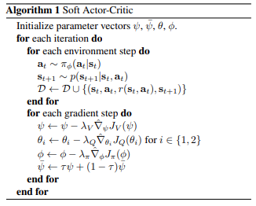
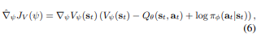
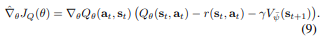
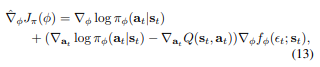

# SAC_PyTorch
Soft Actor-Critic Implementation in PyTorch. \
This is my first challenge of implementation from paper.

Soft Actor-Critic: Off-Policy Maximum Entropy Deep Reinforcement Learning with a Stochastic Actor([Link](https://arxiv.org/abs/1801.01290))

### Memo for implementation

SAC Algorithm\

- double Q-functions to mitigate positive bias in the policy improvement
- gradient of Soft Value Function 
- Optimize Soft Q-Function 
- Objective Gradient 

### TestTask
- Pendulum-v1
- MountainCarContinuous-v0

### Milestone
1. Environment
2. Agent
3. Trainer 

